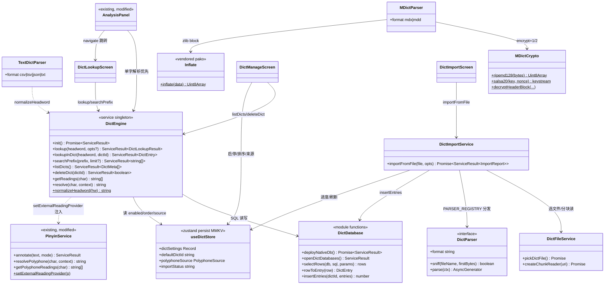
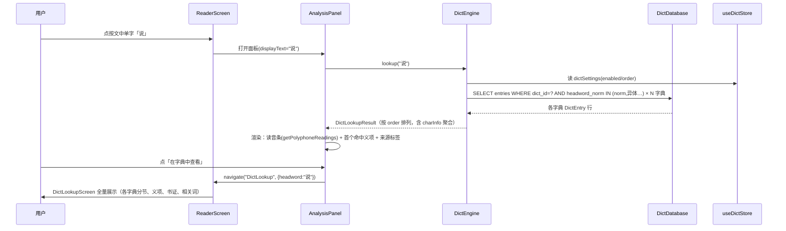
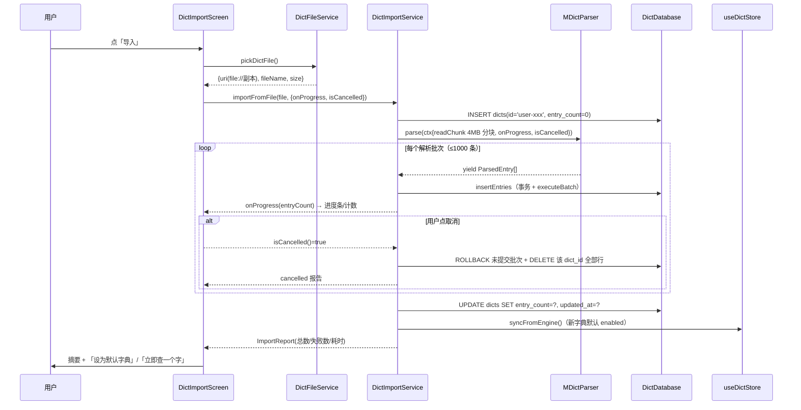
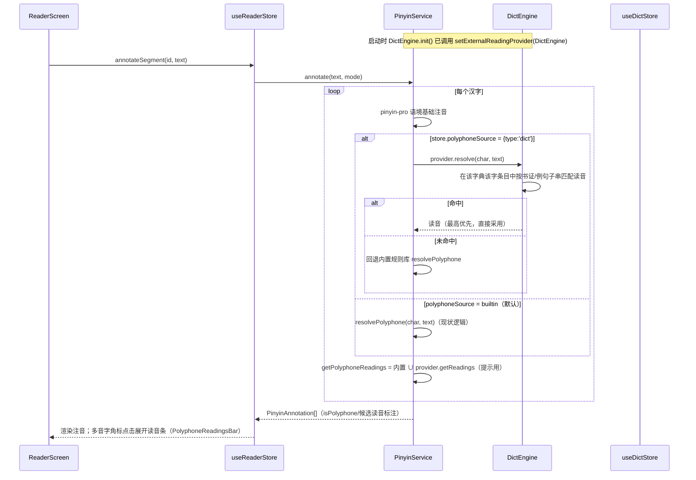

# 架构设计：国学 App 字典能力（guoxue_dict_engine）

- **Language**: 中文
- **文档版本**: v1.0（Architect Bob / 高见远）
- **输入**: `guoxue-dict-prd.md` v1.0 + 项目代码库现状核实（2026-08-27 实地核查）
- **范围**: PRD P0 全部 10 项（原生双字典、统一查询引擎、SQLite 存储、CSV/TSV/JSON/TXT 导入、MDict 导入、字典管理页、查字页、多音字读打通、阅读器跳转）；P1 仅预留扩展点

---

## 1. 实现方案概述

### 1.1 核心技术挑战与对策

| 挑战 | 对策 |
|------|------|
| 大字典数据不能进 JS bundle，且要离线可查 | 双 db 分层：原生字典预构建 SQLite db 随包发布、首启部署到用户目录只读使用；用户字典运行时建 db 写入。全部走 `react-native-quick-sqlite`（已在用，Android .so 冲突已由 packagingOptions 解决，**不引入第二个 sqlite 库**） |
| MDict(.mdx) 是加密/压缩二进制格式，又不允许新增解析依赖 | 自研纯 TS 解析器：MDX 容器解析 + vendored zlib-inflate（从 pako MIT 源码裁剪 inflate 子集，作为源码内嵌而非 npm 依赖）+ RIPEMD128/Salsa20 解密实现 |
| Android 上纯 JS 无法读取用户选择的文件 | **必须新增 `react-native-fs`**（详见 §1.3 依赖偏差说明）：负责 (a) 读取导入文件字节 (b) 拷贝 assets 中预构建 db |
| 多音字判音需要字典数据参与且优先级可仲裁 | PinyinService 增加「外部读音提供者」注入点（`ReadingProvider` 接口），DictEngine 实现该接口；仲裁顺序：用户显式选择来源 > 内置规则库 > 字典候选 |
| MDX 词条是 HTML，RN 无 WebView 依赖 | 自研轻量 HTML 子集渲染器（`EntryContent`），支持 p/br/b/i/u/font[color]/div/ul/li/img(data URI) 常见标签，未识别标签降级为纯文本 |
| 导入大文件不能整载内存 | 分块读取（RNFS.read 按 position/length 4MB 块）+ executeBatch 分批（每批 1000 条）+ 事务 + 取消标志位 + 进度回调 |

### 1.2 架构模式

沿用现有工程模式，不引入新范式：

- **服务层（单例模块 + 命名导出）**：与 `PinyinService`/`StorageService` 一致的「模块级函数 + Service 对象导出」风格，返回 `ServiceResult<T>`。
- **状态层（Zustand v4 + persist/MMKV）**：新增 `useDictStore`（字典元数据/启用/排序/多音字来源持久化；导入进度为非持久化瞬态）。
- **UI 层**：新增底部第 5 个 Tab「字典」（`@react-navigation` v6 Native Stack），复用现有 `BottomSheet`、`theme/colors`、emoji 图标兜底等约定。
- **数据分层**：`scripts/`（离线构建，Node 环境，产出 db）→ `assets/dictionaries/`（随包分发）→ 运行时部署到用户目录 → `DictDatabase`（连接管理）→ `DictEngine`（查询/聚合/仲裁）→ UI。

### 1.3 依赖选型与理由（含一处与主理人决策的偏差）

| 包 | 版本 | 状态 | 理由 |
|----|------|------|------|
| react-native-quick-sqlite | 8.2.7（已在用） | 沿用 | JSI 同步执行、支持 executeBatch/transaction/attach；唯一 SQLite 库 |
| react-native-document-picker | **9.1.2**（锁定，勿装 v10+） | **新增** | v9.x 系 peer 要求 RN ≥0.73，与 RN 0.74.7 兼容；v10 起要求 RN 0.75+/新架构。`copyTo:'cachesDirectory'` 保证拿到本地 `file://` 副本 |
| react-native-fs | **^2.20.0** | **新增（偏差，需主理人确认）** | **技术上不可避免**：RN 的 Android 网络层（OkHttp）只支持 http/https，`fetch/XHR(file://)` 在 Android 不可用，纯 JS 无法读取用户选中文件的字节（iOS 可行但 Android 不行）；同时 assets→用户目录的 db 拷贝也需要文件系统能力（quick-sqlite 8.2.7 无 `moveAssetsDatabase`，已实地核查 src/index.ts）。RNFS 轻量稳定，且支持 Android `content://` 直读与 `copyFileAssets`。若主理人否决，唯一替代是砍掉 P0-6（MDict 导入）并改为 iOS-only，不建议 |
| better-sqlite3 | ^11.x | **devDependency（仅构建脚本）** | `scripts/build-native-dict.mjs` 在 Node 端生成 db，不进 App bundle |
| pako（裁剪源码内嵌） | - | **vendored 源码**（非 npm 依赖） | MDX key/record block 的 zlib 解压需要 inflate；从 pako(MIT) 抽取 inflate 子集约 50KB 放 `src/vendor/`，满足"不新增 npm 依赖"约束 |
| opencc-js / pinyin-pro / zustand / mmkv | 已在用 | 沿用 | 繁简归一化（headword_norm）、注音兜底、状态持久化 |

### 1.4 存储布局决策：原生 db 与用户 db **分文件**

**决策：两个 db 文件，同一套表结构。**

```
<DocumentDirectoryPath>/            （Android=filesDir，iOS=Documents；quick-sqlite 默认库目录）
├─ guoxue.db                        # 现有 StorageService（不动）
├─ dictionaries/
│  ├─ native_dict.db                # 只读。构建期生成，随包分发，首启拷贝落地。含两个原生字典
│  └─ user_dict.db                  # 可写。运行时创建，所有用户导入字典
```

理由：
1. **原生 db 可整体替换**（版本升级 = 覆盖文件 + 更新 user_version，天然支持后续 OTA 字典更新），永不写入，杜绝用户数据与内置数据互相污染；
2. 用户字典删除 = 按 dict_id 清行，VACUUM 收缩，不触碰原生数据；
3. 两库分别 open 两个连接，按 dict 分别查询后在 JS 侧按优先级合并——无需 ATTACH（避免跨库事务复杂度），每查询天然带 dict_id 过滤，索引更小更专一；
4. 原生 db 的「启用/排序」等可变状态不能写进只读库 → 统一放 `useDictStore`（MMKV 持久化），对两库一视同仁。

### 1.5 原生字典数据链路（本期样例先行）

```
开源数据源（Unihan 等）→ scripts/build-native-dict.mjs（Node 离线跑）
   → 产出 assets/dictionaries/native_dict.db
   → Android: android/app/src/main/assets/dictionaries/（RNFS.copyFileAssets 部署）
   → iOS:     加入 Xcode Copy Bundle Resources（RNFS.copyFile(MainBundlePath/...) 部署）
   → 首启 DictEngine.init(): 校验 PRAGMA user_version，不一致则重新拷贝
```

**本期实现**：脚本先从 `src/data/pinyin-dict.json` + 人工样例生成约 300–500 条/字典 的样例 db 验证全链路；全量数据接入（数据源选型、许可核查）为后续工作（见 §9）。脚本输入为通用 JSON（源数据可替换），输出 schema 固定，全量数据只是换输入文件重跑。

---

## 2. 文件列表

### 2.1 新增文件

| 路径 | 说明 |
|------|------|
| `src/types/dict.ts` | 字典域全部类型（DictMeta/DictEntry/DictSense/导入与查询模型） |
| `src/services/dict/DictDatabase.ts` | 双 db 连接管理、DDL、原生 db 部署（RNFS 拷贝 + user_version 校验）、行↔对象映射 |
| `src/services/dict/DictEngine.ts` | 统一查询引擎：lookup / searchPrefix / listDicts / deleteDict / 多音字候选（实现 ReadingProvider） |
| `src/services/dict/DictImportService.ts` | 导入编排：文件→parser→分批入库→进度/取消/错误聚合 |
| `src/services/dict/DictFileService.ts` | 文件选择（document-picker 封装）+ 分块读取（RNFS 封装） |
| `src/services/dict/parsers/types.ts` | `DictParser` 接口 + `ParsedEntry` + 扩展点注册表（P1 StarDict 预留） |
| `src/services/dict/parsers/TextDictParser.ts` | CSV/TSV/JSON/TXT 四合一解析（共享归一化与列映射） |
| `src/services/dict/parsers/MDictParser.ts` | .mdx/.mdd 容器解析（UTF-16LE/UTF-8、key/record block、分块流式） |
| `src/services/dict/parsers/MDictCrypto.ts` | RIPEMD128 + Salsa20（encrypt=1/2 解密） |
| `src/vendor/inflate.ts` | zlib inflate（pako 裁剪，含 LICENSE 注释） |
| `src/store/useDictStore.ts` | 字典设置切片（持久化）+ 导入瞬态（partialize 排除） |
| `src/components/dict/DictEntryCard.tsx` | 单字典来源卡片（来源标签 + 义项列表/HTML 渲染入口） |
| `src/components/dict/EntryContent.tsx` | 内容渲染器（structured / html 子集 / plain 三模式） |
| `src/components/dict/PolyphoneReadingsBar.tsx` | 多音字读音条（全部候选 + 高亮语境判定结果 + 来源） |
| `src/components/dict/DictListItem.tsx` | 管理页字典卡片（启停/排序/删除/词条数/大小） |
| `src/screens/DictLookupScreen.tsx` | 查字页（搜索框 + 字头大字 + 拼音/部首/笔画 + 分字典释义 + 相关词） |
| `src/screens/DictManageScreen.tsx` | 字典管理页（列表 + 导入入口 + 多音字来源简易选择） |
| `src/screens/DictImportScreen.tsx` | 导入页（选文件→进度→摘要三步） |
| `src/services/dict/__tests__/DictEngine.test.ts` | 引擎查询/合并/仲裁单测（mock quick-sqlite） |
| `src/services/dict/__tests__/TextDictParser.test.ts` | 四种文本格式解析单测（纯逻辑，零 mock） |
| `src/services/dict/__tests__/MDictParser.test.ts` | 用测试夹具字节流验证 mdx 解析 |
| `scripts/build-native-dict.mjs` | 原生字典构建脚本（better-sqlite3） |
| `scripts/native-dict-sources.json` | 样例源数据（两字典各数百条；后续替换为全量源） |
| `assets/dictionaries/native_dict.db` | 脚本产物（构建产物，提交入库） |

### 2.2 修改文件

| 路径 | 修改内容 |
|------|----------|
| `package.json` | 新增 2 个运行时依赖 + better-sqlite3 devDep + `"build:native-dict"` script |
| `jestSetupFile.js` | 追加 react-native-fs / react-native-document-picker mock |
| `src/services/PinyinService.ts` | 新增 `setExternalReadingProvider()` 注入点，`resolvePolyphone`/`getPolyphoneReadings` 接入仲裁（改动方式见 §4.3，现有函数签名不变） |
| `src/navigation/types.ts` | 新增 `DictStackParamList`；`AppStackParamList` 增加 DictLookup/DictManage/DictImport |
| `src/navigation/RootNavigator.tsx` | 新增第 5 个 Tab「字典」（词典 📖→用「篆」emoji 或 📕 区分阅读 Tab） |
| `src/components/reader/AnalysisPanel.tsx` | 单字解析改走 DictEngine（保留 word-dict.json 词语路径）；新增「在字典中查看」跳转按钮 |
| `src/App.tsx` | 启动时调用 `DictEngine.init()`（异步，不阻塞渲染） |
| `android/app/build.gradle` | 无需修改（assets 目录直接放文件即可）；iOS 需在 Xcode 工程添加 db 资源（人工/脚本步骤，写入任务验收标准） |

不修改：`DictionaryService.ts`（作为词语解析回退路径继续服务）、`StorageService.ts`、`guoxue.db`。

---

## 3. 数据结构设计

### 3.1 SQLite DDL（native_dict.db 与 user_dict.db 同构）

```sql
-- 元数据表（两库同构；只读库由脚本生成，可写库由 App 生成）
CREATE TABLE IF NOT EXISTS dicts (
  id             TEXT PRIMARY KEY NOT NULL,   -- 'native-modern' | 'native-ancient' | 'user-<genId>'
  name           TEXT NOT NULL,               -- 显示名，如「现代汉字字典」
  kind           TEXT NOT NULL,               -- 'native' | 'user'
  format         TEXT NOT NULL,               -- 'builtin' | 'mdx' | 'csv' | 'tsv' | 'json' | 'txt'
  entry_count    INTEGER NOT NULL DEFAULT 0,
  version        TEXT,                        -- 数据版本（原生 db 部署比对用）
  license        TEXT,                        -- 来源许可（原生字典必填）
  description    TEXT,
  created_at     TEXT NOT NULL,               -- ISO 8601 UTC
  updated_at     TEXT NOT NULL
);

-- 词条表（同一 headword 在同 dict 内可多条：多义项条/大小写等，查询按 order 全取）
CREATE TABLE IF NOT EXISTS entries (
  id            INTEGER PRIMARY KEY AUTOINCREMENT,
  dict_id       TEXT NOT NULL,
  headword      TEXT NOT NULL,                -- 原始字头（保留繁/简/大小写原貌）
  headword_norm TEXT NOT NULL,                -- 归一化字头（见 §3.3），唯一查询入口
  pinyin        TEXT,                         -- 主读音（含声调符号）
  readings_json TEXT,                         -- 多音字候选读音 JSON string[]（原生字典/导入解析）
  content       TEXT NOT NULL,                -- 释义主体：structured 为 DictSense[] 的 JSON；html 为 MDX 原文；plain 为纯文本
  content_type  TEXT NOT NULL,                -- 'structured' | 'html' | 'plain'
  extra_json    TEXT                          -- 可选结构化补充：{radical,strokes,citations,...}
);
CREATE INDEX IF NOT EXISTS idx_entries_lookup ON entries (dict_id, headword_norm);
CREATE INDEX IF NOT EXISTS idx_entries_prefix ON entries (headword_norm);

-- mdd 资源表（仅 user_dict.db；key 形如 "abc.png"，词条 HTML 引用时查 data URI）
CREATE TABLE IF NOT EXISTS resources (
  key        TEXT PRIMARY KEY NOT NULL,
  mime       TEXT NOT NULL,
  size_bytes INTEGER NOT NULL,
  data_base64 TEXT NOT NULL
);

-- 部署版本：原生 db 用 PRAGMA user_version = <NATIVE_DICT_VERSION>（代码常量比对）
```

> 启用/排序/默认字典/多音字来源等**可变状态不入库**（原生库只读），统一持久化在 `useDictStore`（MMKV，key = `guoxue-dict-settings`）。
> FTS5 本期不做（P2-4）。前缀搜索用 `headword_norm LIKE ?||'%'`（CJK 无大小写折叠问题，可走索引）。

### 3.2 统一 DictEntry schema（TS，`src/types/dict.ts`）

```ts
/** 义项（原生字典 / 结构化导入的目标形态） */
export interface DictSense {
  def: string;              // 释义
  pos?: string;             // 词性，如「动」「名」
  label?: string;           // 义项标注，如「古」「今」「书」
  examples?: string[];      // 例句
  citations?: string[];     // 书证（古汉语字典），如「《论语·学而》：学而时习之」
}

/** 词条内容三形态 */
export type DictContentType = 'structured' | 'html' | 'plain';

export interface DictEntry {
  id: number;
  dictId: string;
  headword: string;          // 原始字头
  headwordNorm: string;
  pinyin?: string;
  readings?: string[];       // 多音字候选读音
  contentType: DictContentType;
  content: string;           // structured→DictSense[] JSON；html→MDX HTML；plain→文本
  extra?: {
    radical?: string;
    strokes?: number;
    yiti?: string[];
    ancientSound?: string;   // 古音（反切/拟音）
  };
}

/** 字典元数据（运行时合并视图：db 里的不可变信息 + store 里的可变设置） */
export interface DictMeta {
  id: string;
  name: string;
  kind: 'native' | 'user';
  format: 'builtin' | 'mdx' | 'csv' | 'tsv' | 'json' | 'txt';
  entryCount: number;
  version?: string;
  license?: string;
  description?: string;
  sizeBytes?: number;        // 用户字典文件大小（管理页展示）
  createdAt?: string;
  /* 以下来自 useDictStore（可变，持久化） */
  enabled: boolean;
  order: number;             // 查询优先级，小者先
}

/** 查字聚合结果 */
export interface DictLookupResult {
  headword: string;
  /** 按字典 order 排列；entry 为 null 表示该字典未收录 */
  results: Array<{ dict: DictMeta; entry: DictEntry | null }>;
  /** 单字时聚合的头部信息（radical/strokes 取首个命中字典，yiti/tongjia 来自现有 json 数据） */
  charInfo?: {
    radical?: string;
    strokes?: number;
    yiti: string[];
    tongjia?: { original: string; note: string };
  };
}

/** 多音字读音来源（持久化） */
export type PolyphoneSource =
  | { type: 'builtin' }                     // 内置规则库（默认）
  | { type: 'dict'; dictId: string };       // 某个已启用字典
```

### 3.3 headword_norm 归一化规则（跨文件共享约定）

```
norm(hw) = hw.trim()
         → opencc-js 繁→简（仅汉字，字母数字不动）
         → 拉丁字母 toLowerCase()
         → 去除首尾空白与零宽字符（U+200B/FEFF）
```
单字查询时额外做异体字扩展：`norm(hw)` + `yitiReverse[hw]`（复用 `yiti-zi.json` 索引逻辑）→ IN (?, ?) 查询。导入侧与查询侧共用 `normalizeHeadword()`（放 `src/services/dict/DictEngine.ts` 导出，避免双实现漂移）。

### 3.4 各导入格式 → DictEntry 映射规则

**CSV / TSV**（`TextDictParser`）
- 分隔符：`.csv` = `,`，`.tsv` = `\t`；引号包裹字段支持转义。
- 列映射（两套约定，自动嗅探）：
  - 含表头（首行出现 `字头|词条|headword|word` 任一）→ 按表头映射：`字头/词条/headword/word`→headword；`拼音/pinyin`→pinyin；`释义/词义/meaning/definition`→content；`部首/radical`、`笔画/strokes`、`例句/examples`（内部 `；/;` 分割）→ extra/examples。
  - 无表头 → 约定 2 列（`字头,释义`）或多列但仅取前两列，其余忽略。
- 产出 `contentType: 'structured'`（单段释义转 `[{def}]`）或 `'plain'`（含 HTML 标签时）。
- 空行跳过并计数；某行 headword 为空 → 记错误行号进 `ImportReport.errors`。

**JSON**
- 顶层为对象数组。键名兼容中英文：`headword|字头|词条|word`、`pinyin|拼音`、`meaning|definition|释义|词义`、`examples|例句`、`radical|部首`、`strokes|笔画`、`readings|读音`。
- `meaning` 为字符串 → structured 单义项；为对象数组 `[{def,pos,examples}]` → structured 多义项。
- 顶层若为 `{description, entries: [...]}` 包装结构则取 `entries`。

**TXT**
- 一行一条目。分隔符按优先级嗅探：`：` > `:` > `＝` > `=` > `\t`；首个分隔符左侧=字头（≤4 字），右侧=释义。无分隔符行 → 错误行。
- `contentType: 'plain'`；行内 `〈拼音〉` 前缀（如 `乐〈lè〉：…`）可选拆出 pinyin。

**MDict .mdx**
- headword = key block 原文（保留繁简原貌，入库时另存 norm）；content = record block HTML 原文（**不清洗**，渲染时由 EntryContent 白名单处理）；`contentType: 'html'`。
- 解析出 UTF-16LE/UTF-8（首 4 字节 `00 00 01 00` 判 UTF-16LE）、encrypt 标志（header XML `<Encrypted>`）、编码属性。
- 版本 ≥2.0 走 wide-int 偏移布局。
- **支持**：encrypt 0/1/2（1/2 需 MDictCrypto）、key/record block zlib 压缩或无压缩。
- **明确不支持**（报可读错误）：LZO 压缩 block（纯 TS 无维护良好的实现，实践中罕见）；encrypt 未知值。
- `.mdd`：同容器格式，解析为 resources 表行；单资源 > 1MB 跳过并计数（防止 db 膨胀），总入库上限 50MB。

---

## 4. 核心接口定义（TypeScript 签名级）

### 4.1 DictDatabase（`src/services/dict/DictDatabase.ts`）

```ts
/** 常量 */
export const NATIVE_DICT_VERSION = 1;             // 每次重跑构建脚本 +1
export const NATIVE_DB_FILE = 'native_dict.db';   // location: 'dictionaries'
export const USER_DB_FILE = 'user_dict.db';

/** 部署原生 db（幂等）：不存在或 user_version 落后时从 assets 拷贝覆盖 */
export function deployNativeDb(): Promise<ServiceResult<boolean>>;
/** 打开双连接并建 user 库表（幂等，惰性单例） */
export function openDictDatabases(): ServiceResult<boolean>;
/** 统一 SELECT 辅助（沿用 StorageService.selectRows 模式） */
export function selectRows(dbName: string, sql: string, params?: (string | number)[]): Record<string, unknown>[];
/** 行→DictEntry / 行→DictMeta 映射（导出供引擎与测试复用） */
export function rowToEntry(row: Record<string, unknown>): DictEntry;
export function rowToDictMeta(row: Record<string, unknown>): Omit<DictMeta, 'enabled' | 'order'>;
/** 分批写词条（内部事务 + executeBatch，batchSize=1000） */
export function insertEntries(dictId: string, entries: DictEntry[]): number;
```

### 4.2 DictEngine（`src/services/dict/DictEngine.ts`）

```ts
export const DictEngine = {
  /** App 启动调用：deployNativeDb → openDictDatabases → 同步 useDictStore 元数据 → 注册多音字提供者 */
  init(): Promise<ServiceResult<boolean>>,
  /** 聚合查字：按 useDictStore 中 enabled + order 的字典依次查，合并为 DictLookupResult */
  lookup(headword: string, opts?: { dictIds?: string[] }): ServiceResult<DictLookupResult>,
  /** 单字典查询（查字页切换来源标签用） */
  lookupInDict(headword: string, dictId: string): ServiceResult<DictEntry | null>,
  /** 前缀联想（搜索框建议，limit 默认 20） */
  searchPrefix(prefix: string, limit?: number): ServiceResult<string[]>,
  /** 合并视图：db 元数据 × store 设置（enabled/order），含 entry_count/sizeBytes */
  listDicts(): ServiceResult<DictMeta[]>,
  /** 删除用户字典（清 entries + dicts 行；若为多音字来源则回退 builtin） */
  deleteDict(dictId: string): ServiceResult<boolean>,
  /* ---- ReadingProvider 实现（注入 PinyinService，见 §4.3）---- */
  getReadings(char: string): string[],                       // 各启用字典 readings 并集
  resolve(char: string, context: string): string | null,     // 仅当 store.polyphoneSource 指向字典时尝试语境匹配
};

/** 归一化（导入与查询共用，§3.3） */
export function normalizeHeadword(hw: string): string;
```

### 4.3 PinyinService 注入点（修改现有文件，向后兼容）

```ts
// src/services/PinyinService.ts 追加：
export interface ReadingProvider {
  getReadings(char: string): string[];
  resolve(char: string, context: string): string | null;
}
export function setExternalReadingProvider(p: ReadingProvider | null): void;
```

判音仲裁（`annotate()` 内步骤 2 扩展，**现有导出签名不变**）：

```
最终读音 = provider?.resolve(char, text)        // ① 用户显式选择的字典来源（最高）
        ?? resolvePolyphone(char, text)          // ② 内置规则库（现状不变）
        ?? pinyin-pro 语境 / PINYIN_DICT 兜底     // ③ 现状兜底链

getPolyphoneReadings(char) = 内置 POLYPHONE[char] ∪ provider?.getReadings(char)   // 候选并集，供提示 UI
```

> 循环依赖规避：`PinyinService` 不 import `DictEngine`；由 `DictEngine.init()` 末尾调用 `setExternalReadingProvider(DictEngine)` 完成注入（依赖方向：dict → pinyin，单向）。

### 4.4 导入管线（parsers + DictImportService + DictFileService）

```ts
// src/services/dict/parsers/types.ts
export interface ParsedEntry {
  headword: string;
  pinyin?: string;
  readings?: string[];
  contentType: DictContentType;
  content: string;
  extra?: DictEntry['extra'];
}
export interface DictParserContext {
  /** 分块读文件（position 起 length 字节，base64 → Uint8Array）；解析器绝不整读大文件 */
  readChunk(position: number, length: number): Promise<Uint8Array>;
  /** 文件总字节数 */
  fileSize: number;
  /** 每解析 N 条回调一次（UI 进度） */
  onProgress: (entryCount: number) => void;
  /** 取消标志（UI 触发）；解析器在每个块边界检查 */
  isCancelled: () => boolean;
  /** 单条解析失败记录（行号/偏移/原因），不打断整体 */
  reportError: (e: { at?: number | string; reason: string }) => void;
}
export interface DictParser {
  readonly format: 'csv' | 'tsv' | 'json' | 'txt' | 'mdx' | 'mdd';
  sniff(fileName: string, firstBytes: Uint8Array): boolean;
  parse(ctx: DictParserContext): AsyncGenerator<ParsedEntry[], void, void>;  // 每批 ≤1000 条
}
export const PARSER_REGISTRY: DictParser[];   // 扩展点：P1 追加 StarDictParser 即注册即用

// src/services/dict/DictFileService.ts
export const DictFileService = {
  /** 文件选择（限定扩展名，copyTo cachesDirectory 拿稳定本地路径） */
  pickDictFile(): Promise<ServiceResult<{ uri: string; fileName: string; size: number }>>,
  /** 供 parser ctx 的分块读取实现（RNFS.read base64 → Uint8Array） */
  createChunkReader(uri: string): Promise<{ fileSize: number; readChunk(pos: number, len: number): Promise<Uint8Array> }>,
};

// src/services/dict/DictImportService.ts
export interface ImportReport {
  dictId: string;
  totalEntries: number;
  failedCount: number;
  errors: Array<{ at?: number | string; reason: string }>;  // 上限 100 条，超出聚合计数
  elapsedMs: number;
  cancelled: boolean;
}
export const DictImportService = {
  /** 导入主流程：建 dicts 行(先计数 0) → 流式解析分批入库 → 回填 entry_count → store 刷新 */
  importFromFile(file: { uri: string; fileName: string; size: number }, opts: {
    displayName?: string;
    onProgress?: (entryCount: number) => void;
    isCancelled?: () => boolean;
  }): Promise<ServiceResult<ImportReport>>,
};

// src/store/useDictStore.ts（partialize 只持久化前 5 个字段）
interface DictState {
  dictSettings: Record<string, { enabled: boolean; order: number }>;  // dictId → 设置
  defaultDictId: string | null;                                       // 查字页默认聚焦字典
  polyphoneSource: PolyphoneSource;                                   // 默认 {type:'builtin'}
  setEnabled(dictId: string, enabled: boolean): void;
  reorder(dictId: string, direction: 'up' | 'down'): void;
  setDefaultDict(dictId: string): void;
  setPolyphoneSource(src: PolyphoneSource): void;
  syncFromEngine(): void;                        // listDicts 结果写回 settings（新增字典默认 enabled:true）
  /* 瞬态（不持久化） */
  importStatus: 'idle' | 'parsing' | 'writing' | 'done' | 'error' | 'cancelled';
  importProgress: { fileName: string; entryCount: number; error?: string };
  setImportStatus(s: DictState['importStatus'], p?: Partial<DictState['importProgress']>): void;
}
```

### 4.5 类图



### 4.6 调用流程时序图

**① 查字流程（阅读器点按 → 查字页）**



**② 导入流程（MDict）**



**③ 多音字联动流程（阅读器注音）**



---

## 5. 性能预算与实现约束

| 指标 | 目标 | 实现约束 |
|------|------|----------|
| 单字查询 | < 50ms | 同步 SQL + 索引（dict_id, headword_norm）；JS 侧零全表加载；快照在 `DictEngine.test.ts` 断言查询路径 SQL 走索引 |
| 首启部署 | < 3s（样例 db）/ 可接受全量一次 < 10s | `DictEngine.init()` 异步不阻塞 App 渲染；db 为单文件直拷 |
| 10MB mdx 导入 | < 60s（中端机） | 4MB 分块读 + 1000 条/批事务 + executeBatch |
| 内存峰值 | < 300MB | 解析器持有当前块 + 当前批；AsyncGenerator 逐批释放；mdd 资源 >1MB 跳过 |
| db 体积 | 样例 <2MB；全量原生 <60MB | 释义 TEXT 原样存储，无冗余列 |

其他硬约束：quick-sqlite 仅在真机 JSI 可用（Chrome 远程调试会抛错——已有行为，测试统一 mock）；所有 Service 返回 `ServiceResult<T>`；时间戳 ISO 8601 UTC。

---

## 6. 任务列表（实施蓝图，按依赖排序，共 5 个）

> 每个任务 ≥3 个文件；T01 为基础设施；T02/T03 仅依赖 T01 可并行；T04 依赖 T02；T05 收尾集成。

### T01 项目基础设施与存储层（P0）

- **依赖**：无
- **文件**：`package.json`（修改：+react-native-document-picker@9.1.2、+react-native-fs@^2.20.0、+better-sqlite3@^11 devDep、+`"build:native-dict": "node scripts/build-native-dict.mjs"`）、`jestSetupFile.js`（修改：RNFS 与 document-picker mock，RNFS mock 需支持 `read/readFile/exists/copyFile/copyFileAssets/DocumentDirectoryPath/MainBundlePath/unlink/stat`）、`src/types/dict.ts`（新增：§3.2 全部类型）、`src/services/dict/DictDatabase.ts`（新增：§4.1 全部函数 + §3.1 DDL）
- **验收标准**：
  1. `npm install` 后 Android/iOS 构建通过（document-picker 9.1.2 与 RN 0.74.7 无 peer 冲突；Android 无新增 .so 冲突）；
  2. 单测 `DictEngine.test.ts` 前置部分（暂放临时用例，T02 合入正式版）：mock quick-sqlite 下 `openDictDatabases()` 幂等、`rowToEntry` 映射 readings_json/extra_json 正确；
  3. `src/types/dict.ts` 通过 `tsc --noEmit`；
  4. 现有 `npm test` 全绿（mock 不破坏 useReaderStore 既有用例）。

### T02 统一查询引擎 + 多音字打通 + 字典 Store（P0）

- **依赖**：T01
- **文件**：`src/services/dict/DictEngine.ts`（新增：init/lookup/lookupInDict/searchPrefix/listDicts/deleteDict/getReadings/resolve/normalizeHeadword，§4.2）、`src/store/useDictStore.ts`（新增：§4.4 store 切片，persist MMKV key `guoxue-dict-settings`，partialize 排除 importStatus/importProgress）、`src/services/PinyinService.ts`（修改：`ReadingProvider` 接口 + `setExternalReadingProvider()`；`annotate` 步骤 2 插入仲裁；`getPolyphoneReadings` 并集——**所有现有导出签名不变**）、`src/services/dict/__tests__/DictEngine.test.ts`（新增）
- **验收标准**：
  1. `lookup('说')` 在 mock 双库下返回按 order 排序的 results，未收录字典 entry=null；异体字/繁体字头可命中（norm + yiti 扩展）；
  2. 仲裁单测：provider.resolve 命中 > 规则库；provider 未配置时行为与改动前 `annotate` 完全一致（用既有注音结果做快照断言）；
  3. `getPolyphoneReadings('乐')` 返回内置 ∪ 字典 readings 去重副本；
  4. `deleteDict` 清行且回退 polyphoneSource；`searchPrefix('学')` 返回去重字头列表；
  5. `npm run typecheck`、`npm test` 全绿。

### T03 导入管线与格式解析器（P0）

- **依赖**：T01（可与 T02 并行）
- **文件**：`src/services/dict/parsers/types.ts`（新增：DictParser 接口 + PARSER_REGISTRY）、`src/services/dict/parsers/TextDictParser.ts`（新增：CSV/TSV/JSON/TXT，§3.4 规则）、`src/services/dict/parsers/MDictParser.ts`（新增：mdx/mdd 容器解析，分块流式）、`src/services/dict/parsers/MDictCrypto.ts`（新增：RIPEMD128 + Salsa20）、`src/vendor/inflate.ts`（新增：pako inflate 裁剪，头部保留 MIT LICENSE 与来源注释）、`src/services/dict/DictFileService.ts`（新增：pickDictFile + createChunkReader）、`src/services/dict/DictImportService.ts`（新增：§4.4 importFromFile + ImportReport）、`src/services/dict/__tests__/TextDictParser.test.ts`、`src/services/dict/__tests__/MDictParser.test.ts`（新增：用 Node 脚本生成的最小 mdx 夹具字节流）
- **验收标准**：
  1. 四种文本格式各一个样例文件解析出的 ParsedEntry 与 §3.4 映射一致（含表头/无表头两套 CSV、中文键 JSON、TXT 分隔符嗅探、错误行记录）；
  2. mdx 夹具（UTF-8 无加密 + UTF-16LE encrypt=2 各一）解析出正确 headword 列表与 HTML 内容；LZO 夹具返回可读错误「暂不支持 LZO 压缩」；
  3. `importFromFile`：mock quick-sqlite 断言分批调用 `insertEntries`、entry_count 回填、isCancelled 触发清理路径；
  4. 所有 parser 为纯逻辑（仅依赖 readChunk 注入），单测零原生 mock（inflate/MDictCrypto 直接真实执行）。

### T04 字典 UI 三页 + 导航 + 阅读器跳转（P0）

- **依赖**：T02（引擎可用）；导入页渲染依赖 T03 的 store 字段但不阻塞（可先用 T02 已含的 importStatus 类型）
- **文件**：`src/screens/DictLookupScreen.tsx`、`src/screens/DictManageScreen.tsx`、`src/screens/DictImportScreen.tsx`（新增：PRD UI Draft 1–4 对应实现，含免责声明文案）、`src/components/dict/DictEntryCard.tsx`、`src/components/dict/EntryContent.tsx`（HTML 子集白名单渲染）、`src/components/dict/PolyphoneReadingsBar.tsx`、`src/components/dict/DictListItem.tsx`（新增）、`src/navigation/types.ts`（修改：DictStackParamList + AppStackParamList 增 DictLookup{headword}/DictManage/DictImport）、`src/navigation/RootNavigator.tsx`（修改：第 5 Tab「字典」）、`src/components/reader/AnalysisPanel.tsx`（修改：单字解析优先 DictEngine.lookup、保留 DictionaryService 词语回退、新增「在字典中查看」按钮）
- **验收标准**：
  1. 「字典」Tab 可达：搜索框输入字/词 → 前缀联想（searchPrefix）→ 结果页字头大字 + 拼音多音条 + 部首笔画 + 各启用字典分节释义 + 相关词（word-dict.json）；
  2. EntryContent 三模式渲染：structured 义项编号/词性/书证斜体；html 白名单标签生效、未知标签文本化、img 经 resources 表转 data URI、无资源时占位；plain 原样；
  3. 管理页：启停/上下移排序立即影响 lookup 顺序；用户字典滑动删除有确认弹窗；显示词条数与文件大小；「多音字读音来源」单选（内置/各启用字典）切换后阅读器注音即时生效（切换 polyphoneSource 后清 useReaderStore 注音缓存并重算当前段）；
  4. 导入页三步流转 + 进度 + 取消 + 错误列表 + 完成摘要（真机验证一个 >5MB mdx）；
  5. AnalysisPanel：查「说」显示字典义项与来源标签；「在字典中查看」跳转 DictLookupScreen 且返回不丢阅读位置。

### T05 原生字典数据脚本 + 端到端集成与调优（P0）

- **依赖**：T01–T04
- **文件**：`scripts/build-native-dict.mjs`（新增：读 `scripts/native-dict-sources.json` → better-sqlite3 建 dicts+entries → 写 `assets/dictionaries/native_dict.db`，`PRAGMA user_version=NATIVE_DICT_VERSION`）、`scripts/native-dict-sources.json`（新增：现代字典/古汉语字典各 ≥300 条样例，字段=§2.1 ParsedEntry 超集）、`src/App.tsx`（修改：启动 `DictEngine.init().catch(降级：字典 Tab 显示初始化失败态，不影响其他功能)`）、`assets/dictionaries/native_dict.db`（新增：脚本产物）、`android/app/src/main/assets/dictionaries/`（新增目录：db 放置处）、iOS Xcode 工程（修改：db 加入 Copy Bundle Resources——记录操作步骤于任务备注）
- **验收标准**：
  1. `npm run build:native-dict` 可重复执行且输出幂等（同输入同 db）；
  2. 冷启动首启：部署日志确认 db 拷贝发生；二次启动不重复拷贝（user_version 命中）；手动调高 NATIVE_DICT_VERSION 后重启能触发重拷；
  3. 端到端：清装 App → 首启 → 字典 Tab 查「学」「仁」两字典均有结果 → 导入一个 CSV 用户字典 → 管理页排序调整 → 查字页三来源对照 → 阅读器打开《论语》注音正常、多音字角标含字典读音候选；
  4. 性能实测：单字查询 <50ms（真机 adb log 计时）、样例库首启部署 <3s、导入 5MB 级文本字典 <30s；
  5. 回归：现有功能（注音/搜索/背诵/收藏）全部无回归，`npm run typecheck && npm test` 全绿。

---

## 7. 依赖包清单

```
# 运行时新增（仅 2 个，均为原生模块）
- react-native-document-picker@9.1.2   # 文件选择；v10+ 需 RN 0.75+，锁死 9.x
- react-native-fs@^2.20.0              # 文件读取/资源拷贝（Android 读导入文件的唯一途径，见 §1.3 偏差说明）

# 开发期新增（不进 App）
- better-sqlite3@^11.0.0               # scripts/build-native-dict.mjs 构建期专用

# 沿用（零新增）
- react-native-quick-sqlite@8.2.7      # 唯一 SQLite 运行时
- zustand@^4.5.0 / react-native-mmkv   # store + 持久化
- opencc-js@^1.0.5                     # headword 繁简归一化
- pinyin-pro@^3.20.0                   # 注音兜底
# vendored：pako inflate 子集（源码内嵌 src/vendor/inflate.ts，MIT，非 npm 依赖）
```

---

## 8. 共享知识与约定（工程师必读）

1. **返回格式**：所有 Service 方法返回 `ServiceResult<T>`（`{success, data?, error?}`），错误信息带中文上下文前缀（如「导入失败：…」），与现有服务一致。
2. **时间与 ID**：ISO 8601 UTC（`nowISO()` 从 StorageService 导入复用）；用户字典 id 用 `genId('user')` 复用现有工具。
3. **数据库**：字典域只用 `dictionaries/` 子目录下两个 db，**严禁**触碰 `guoxue.db`；quick-sqlite 调用沿用 StorageService 的 `open({name})` + `execute` + `rows._array` 模式；批量写入必须 `executeBatch` + 事务，批大小 1000。
4. **归一化唯一入口**：`normalizeHeadword()`（DictEngine 导出）；任何写 headword_norm 的代码（parser、脚本）与查询代码必须调用同一函数，禁止各自实现（脚本侧为等价 JS 复制并在注释互指）。
5. **只读原则**：native_dict.db 打开后只 SELECT；启用/排序/默认/多音字来源等可变状态只存 `useDictStore`（MMKV）。
6. **PinyinService 兼容性**：本次只加 `setExternalReadingProvider` 与内部仲裁，现有导出（`annotate/resolvePolyphone/getPolyphoneReadings/isRareChar`）签名与默认行为不得变化；`useReaderStore` 现有注音快照测试必须保持通过。
7. **取消与进度**：导入全链路经 `isCancelled()` 回调与 `onProgress(entryCount)`（计数而非百分比——总数解析前未知）；取消必须清理半成品 dict_id 行。
8. **测试约定**：延续 `jest.config.js`（configFile:false + node 环境）模式；新增原生模块必须先在 `jestSetupFile.js` 加 mock；parser/crypto/inflate 全部为可在 node 环境直跑的纯逻辑。
9. **路径别名**：一律 `@/`；新 screen 挂 `AppStackParamList`（沿用现有「应用级全路由表」约定）。
10. **HTML 渲染安全**：EntryContent 只渲染白名单标签，所有文本节点经 RN `<Text>` 输出（自动转义），禁止 WebView/eval；img 仅允许 data: 与资源表解析出的 URI。

---

## 9. 待明确事项（UNCLEAR）

1. **【需主理人拍板】react-native-fs 偏差**：主理人原设定「唯一新增原生依赖为 document-picker」，经核查技术上不可行（Android OkHttp 不支持 file:// 读取，quick-sqlite 8.2.7 无 moveAssetsDatabase——均已在 node_modules 实地验证）。本方案按新增 2 个原生依赖设计；若否决 RNFS，MDict 导入需降级为 iOS-only 或砍需求。
2. **原生字典数据源与许可**：样例数据本期人工整理（基于现有 `pinyin-dict.json` + 人工释义）；全量数据建议 Unihan（Unicode License，读音/部首/笔画安全）+ CC-CEDICT（CC-BY-SA 4.0，需法务确认商用归因方式）+ 古汉语开源语料（候选：汉典衍生/开源说文项目，许可逐一核查）。脚本输入为通用 JSON，数据源决策不影响本期架构。
3. **MDX 加密变体覆盖边界**：encrypt=0/1/2 + zlib/无压缩为 P0 验收范围；LZO 压缩明确不支持（报可读错误）。若市面高频词典实测存在 LZO 占比超预期，二期评估内嵌 lzo 解压 port。
4. **多音字字典语境匹配算法深度**：本期 `DictEngine.resolve` 采用「书证/例句子串包含匹配」的朴素实现（与内置规则库同构）；语义级匹配（义项消歧）留二期。
5. **iOS 资源集成自动化**：db 加入 Xcode Copy Bundle Resources 目前为手工/脚本辅助步骤，若后续接入 CI 需补充 fastlane/xcodebuild 脚本（不影响本期交付）。
6. **mdd 资源上限参数**（单文件 1MB / 总量 50MB）为首版拍脑袋值，真机验证后可调；超限跳过并在导入摘要中明示。
7. **查字页发音**（字头点击 TTS）为 P2，UI 预留可点击区域但首期点击无动作（避免假交互，按下不响应即可）。
